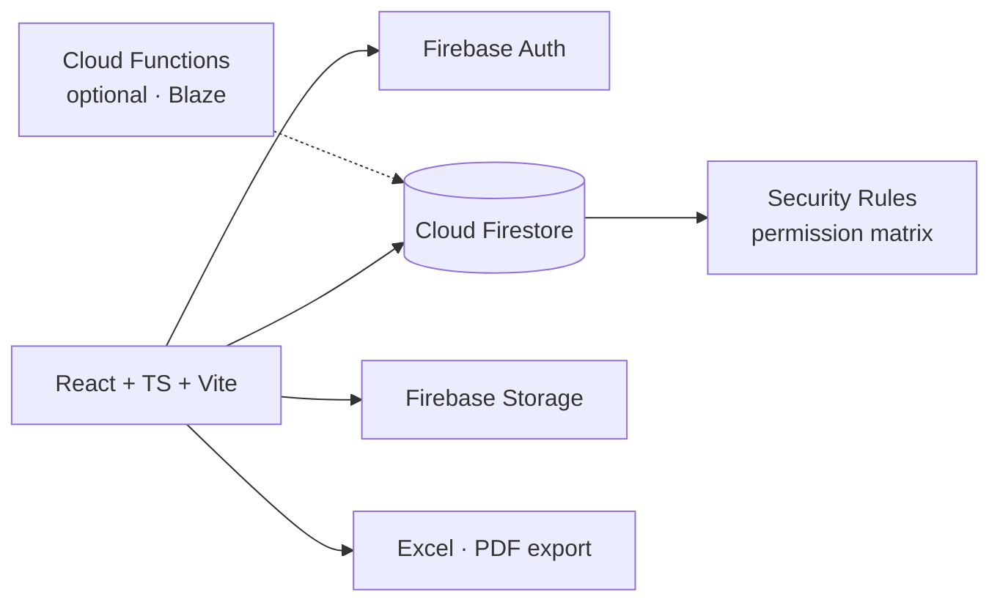

<div align="center">

# 📨 IQCS — Inquiry & Quotation Control System
### Workflow tracking for engineering inquiries — from receipt to award


</div>

---

## 📌 Overview

A live, multi-user system built for a contracting company's estimation department. Every incoming inquiry (ticket) is tracked through a **20-state workflow** — who received it, when work actually started, who is late, what problems happened and how much time each inquiry consumed — with **SLA timers based on working hours**.

> Pricing itself happens in the company's main ERP; this system is the **control tower** around it: tracking, accountability, issues and reporting.

## ✨ Features

- 🔁 **20-state workflow** with an explicit transition table and approval queue
- ⏱️ **SLA engine** — business-hours clock that starts when the engineer presses *"Receive & start"*, separate response time vs. work time, consumption bar
- 👥 **Multi-engineer assignment** — main owner + collaborators, each notified
- ✅ **Task system** — assign to one or many engineers, each with an individual timer
- ⚠️ **Issue log** — 11 issue types × 3 severities, responsible party and time lost
- 🔐 **60+ permissions** in a role matrix + per-user exceptions, enforced in **Firestore Security Rules**
- 🧾 **Activity log with Undo** + 30-day **Recycle Bin** with full cascade restore
- 📣 **Broadcast messages** with read receipts and delivery analytics
- 🌍 **Country filter** (KSA / UAE) with per-country currency & VAT
- 📊 **12+ reports** — Excel (frozen headers, autofilter) and branded print-ready PDF, Arabic & English
- 🎨 6 themes + custom theme, bilingual RTL/LTR UI

## 🏗️ Architecture



Runs fully on the **free Spark plan**; Cloud Functions (scheduled end-of-day report, overdue sweeps) are optional add-ons with client-side fallbacks.

## 🚀 Getting Started

```bash
npm install
cp .env.example .env        # your Firebase web config (VITE_FIREBASE_*)
firebase deploy --only firestore:rules,firestore:indexes,storage
npm run dev
```

The first launch opens a one-time **Super Admin setup** screen. Full guide (Arabic): **[docs/SETUP_AR.md](docs/SETUP_AR.md)**

## 🗂️ Project Structure

```
src/pages/         dashboard, inquiries, tasks, reports, admin screens
src/services/      Firestore data layer (inquiries, tasks, issues, maintenance…)
src/constants/     workflow states, countries, themes
firestore.rules    permission-aware security rules
functions/         optional Cloud Functions
```

---

## 👤 Author

**Mahmoud Shahab** — AI Department Manager · AI Automation & Operations
Building AI-powered systems that turn messy operations into clear, trackable workflows.

[](https://www.linkedin.com/in/mahmoud-shahab-ai)
[](https://github.com/ShekoDev)

© Mahmoud Shahab — All rights reserved.
